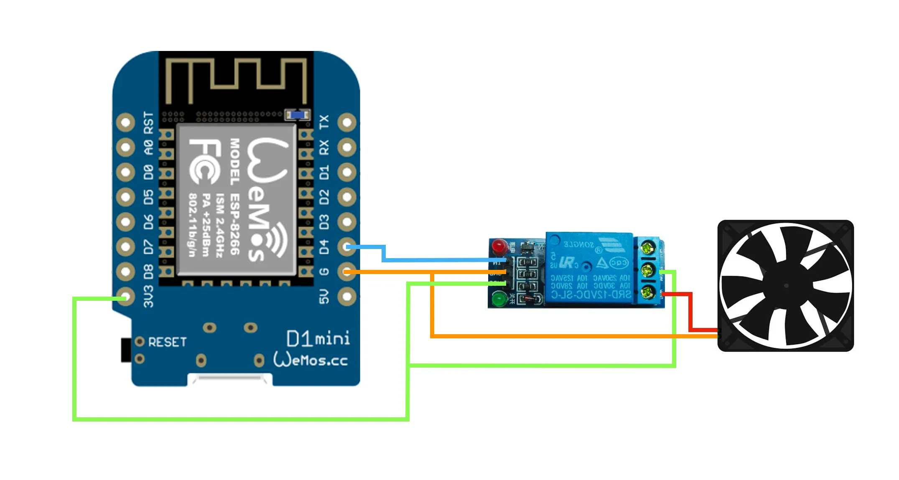
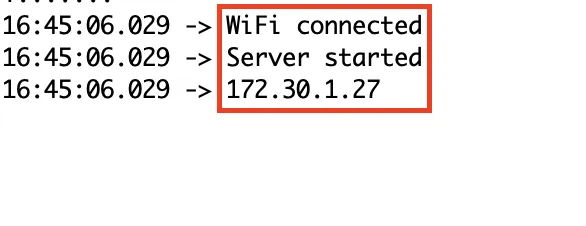

# How to set ESP8266

## Circuit


## Upload Sketch
1. Set your wifi info in 5, 6 line
```
const char *ssid = "YourNetworkSSID";
const char *password = "YourNetworkPassword";
```

2. Set your pin number in 7 line
```
const int relayPin = "YourPinNumber";

// The pin number of the circuit I use was 2.
const int relayPin = 2;
```

3. Upload sketch

4. Check the serial monitor to get your local IP. Use this IP in homebridge config.


